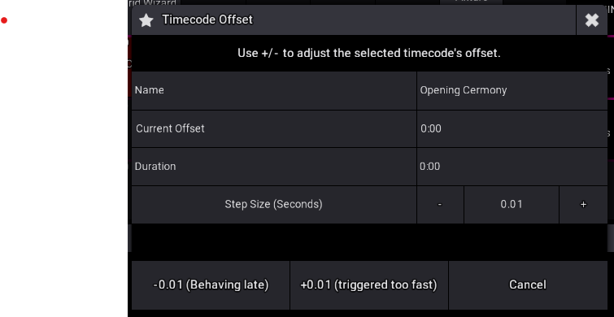

# Timecode Offset for grandMA3

  

A small grandMA3 plugin for nudging the offset of the **selected timecode show** while you're running it. You get a pop-up with **+** and **−** buttons and an adjustable step size, so you can line cues up with the audio or video without typing timecode values by hand.

> Built by **LEDvard** ([@kinglevel](https://github.com/kinglevel)). It has had very little testing, so treat it as a community tool and please send back fixes and improvements.

---

## Features

- **One-tap offset nudging.** Shift the selected timecode's offset forward or back by the current step.
- **Adjustable step size.** It starts at `0.01 s` and changes in `0.01 s` increments.
- **Live readout.** The current offset (`OFFSETTCSLOT`) refreshes after every adjustment.
- **Timecode info.** The pop-up shows the selected timecode's name and duration.
- **Sub-frame precision.** Offsets are written straight to MA3's raw Q24 fixed-point field (`RAWOFFSETTCSLOT`, 2²⁴ units per second), so small steps aren't rounded to whole frames.
- **Opens on your focused display**, and falls back to display 1 when the focus is on a display above 5.

## Requirements

| | |
|---|---|
| Console / software | grandMA3 (exported from data version **2.5.1.0**) |
| Plugin version | `0.0.0.4` |

## Installation

1. Copy **both** files into your MA3 plugin library folder:
   - `TimecodeOffsetMA3.xml`
   - `TimecodeOffsetMA3.lua`

   | Platform | Path |
   |---|---|
   | grandMA3 onPC (Windows) | `C:\ProgramData\MALightingTechnology\gma3_library\datapools\plugins\` |
   | Console / USB stick | `gma3_library/datapools/plugins/` |

2. In MA3, open the **Plugins** pool, edit an empty slot, choose **Import**, and select `TimecodeOffsetMA3`.
3. The plugin appears in the pool as a red object called **TimecodeOffsetMA3**.

## Usage

1. **Select the timecode show** you want to adjust. The plugin works on MA3's *selected* timecode (`SelectedTimecode()`).
2. **Run the plugin** by tapping it in the Plugins pool, or with a command like `Plugin "TimecodeOffsetMA3"`.
3. Use the dialog:

   | Control | What it does |
   |---|---|
   | **Step Size −** / **+** | Decreases or increases the step by `0.01 s` |
   | **−step (Behaving late)** | Subtracts the step from the offset. Use it when cues fire **late**. |
   | **+step (triggered too fast)** | Adds the step to the offset. Use it when cues fire **too early**. |
   | **Cancel** / **✕** / `Esc` | Closes the dialog |

The *Current Offset* row updates after every press, so you can watch your correction add up.

## Known limitations

- **Name and duration are read once** when the dialog opens. If you select a different timecode while the dialog is open, reopen the plugin. The +/- buttons always act on whichever timecode is selected at the moment you press them.
- **There is no undo.** Write down your original offset before you start experimenting.

## Contributing

Contributions are very welcome. This tool exists for the community.

- 🐛 **Bugs and ideas**: [open an issue](https://github.com/kinglevel/TimecodeOffsetMA3/issues)
- 🔧 **Fixes and features**: fork the repo, make your change, and open a pull request
- 💬 Include your **MA3 software version** in reports. The plugin API changes between releases.

